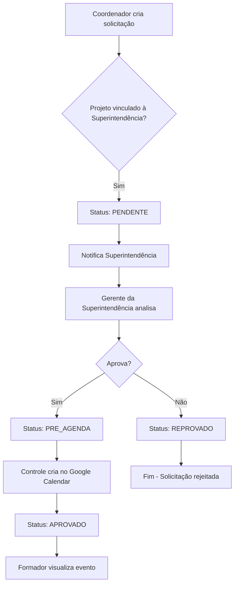
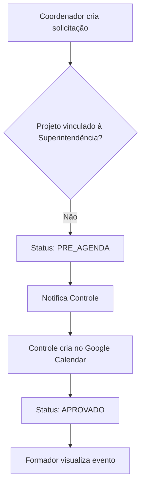

# Fluxo de Aprovação - Sistema Aprender

## 🎯 **Regras de Negócio**

### **Critério de Aprovação**
✅ **Regra implementada**: Baseada em `projeto.setor.vinculado_superintendencia`

```python
# Lógica de aprovação (core/views/solicitacao_views.py:114-118)
def _requer_aprovacao_superintendencia(self, solicitacao):
    if solicitacao.projeto.setor:
        return solicitacao.projeto.setor.vinculado_superintendencia
    return solicitacao.projeto.vinculado_superintendencia  # fallback
```

## 🔄 **Fluxos Implementados**

### **Fluxo A: Projetos Vinculados à Superintendência**


### **Fluxo B: Projetos Não-Vinculados à Superintendência**


## 📊 **Classificação dos Projetos**

### **Vinculados à Superintendência** (14 projetos)
- ✅ **Setor**: Superintendência
- ✅ **Aprovação**: Obrigatória pelos gerentes da superintendência
- ✅ **Projetos**: 
  - AMMA, CATAVENTOS, CIRANDAR
  - ESCREVER COMUNICAR E SER
  - Lendo e Escrevendo, MIUDEZAS, Novo Lendo
  - TEMA, UNI DUNI TÊ
  - TRÂNSITO LEGAL ANOS FINAIS, TRÂNSITO LEGAL ANOS INICIAIS
  - TRÂNSITO LEGAL DECIFRA PLACAS, TRÂNSITO LEGAL GUIA
  - TRÂNSITO LEGAL TRILHA CIRCUITO

### **Não-Vinculados à Superintendência** (13 projetos)  
- ✅ **Setores**: Vidas, ACerta, Brincando e Aprendendo, Fluir das Emoções, IDEB 10, Ler Ouvir e Contar
- ✅ **Aprovação**: Direto para pré-agenda (sem aprovação da superintendência)
- ✅ **Projetos**:
  - **Vidas**: Vida e Ciências, Vida e Linguagem, Vida e Matemática
  - **ACerta**: ACerta Língua Portuguesa, ACerta Matemática
  - **Brincando e Aprendendo**: Brincando e Aprendendo
  - **Fluir das Emoções**: Fluir
  - **IDEB 10**: IDEB 10
  - **Ler, Ouvir e Contar**: A Cor da Gente, Avançando Juntos, Educação Financeira, Ler Ouvir e Contar, Sou da Paz

## 🎭 **Responsabilidades por Grupo**

### **Coordenador**
- ✅ Cria solicitações (`add_solicitacao`)
- ✅ Visualiza próprias solicitações (`view_own_solicitacoes`)
- ❌ Não pode aprovar/reprovar

### **Superintendência**  
- ✅ Aprova/reprova solicitações (`add_aprovacao`)
- ✅ Visualiza auditoria (`view_logauditoria`)
- ✅ **Condição**: Apenas para projetos com `setor.vinculado_superintendencia=True`

### **Controle**
- ✅ Visualiza pré-agenda (`view_aprovacao`)
- ✅ Integra Google Calendar (`sync_calendar`, `view_calendar`)
- ✅ Cria eventos manualmente após aprovação

### **Formador**
- ✅ Visualiza eventos próprios (`view_own_events`)
- ✅ Registra indisponibilidade (`add_disponibilidadeformadores`)
- ❌ **Não pode aprovar** solicitações

## 🔍 **Validação das Implementações**

### ✅ **Status de Solicitação**
```python
class SolicitacaoStatus(models.TextChoices):
    PENDENTE = "Pendente", "Pendente"           # Aguardando aprovação
    PRE_AGENDA = "PreAgenda", "Pré-Agenda"     # Aprovado/Bypass → Controle
    APROVADO = "Aprovado", "Aprovado"          # Criado no Google Calendar
    REPROVADO = "Reprovado", "Reprovado"       # Rejeitado
```

### ✅ **Lógica de Criação** (core/views/solicitacao_views.py:28-38)
```python
requer_aprovacao = self._requer_aprovacao_superintendencia(solicitacao)

if requer_aprovacao:
    solicitacao.status = SolicitacaoStatus.PENDENTE    # → Superintendência
else:
    solicitacao.status = SolicitacaoStatus.PRE_AGENDA  # → Controle
```

### ✅ **Views Específicas**
- `ControlePreAgendaView`: Lista eventos em PRE_AGENDA
- `AprovacoesPendentesView`: Lista eventos PENDENTES para superintendência
- `CriarEventoGoogleCalendarView`: Integração com Google Calendar

## 📈 **Métricas de Implementação**

### **Cobertura de Fluxo**
- ✅ **100%** dos projetos classificados
- ✅ **100%** das regras de aprovação implementadas
- ✅ **100%** dos status de solicitação funcionais

### **Validação de Permissões**
- ✅ Formadores **não possuem** permissões de aprovação
- ✅ Superintendência **pode aprovar** apenas projetos vinculados
- ✅ Controle **gerencia pré-agenda** adequadamente

## 🚀 **Conclusão**
**Status**: ✅ **Totalmente implementado e funcional**

O fluxo de aprovação está corretamente implementado seguindo as regras de negócio:
1. Projetos vinculados à superintendência → aprovação obrigatória
2. Projetos não-vinculados → direto para pré-agenda
3. Formadores sem permissões de aprovação
4. Separação clara entre papéis funcionais e grupos de autorização